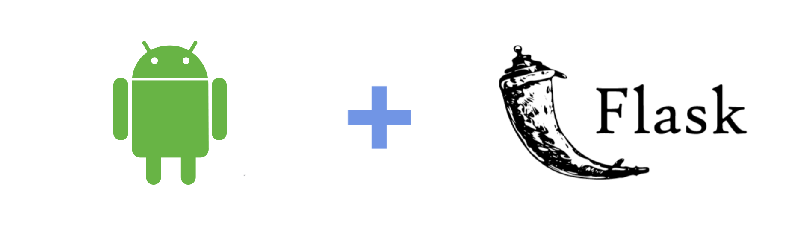

Note: this code is meant to be a project of an android app for the heart disease.
# Android Client/Flask Server :+1:
Are you mobile developer with some background in pythom programming ?
Ever wondered of exploring/making backend services for your apps by own.? 
I recently encountered Python Flask framework.
So what you will need ?

## Flask web app (Python3, Flask, PyCharm IDE)

#### Step 1 - Install Flask framework
Go to your terminal and type the following command: 

      $ pip3 install Flask
#### Step 2 - Start using it(Coding).  

## Android App (OkHttp/Retrofit,Java/Kotlin, Android Studio)
#### Step 1 - Setup your environment. 
#### Step 2 - Start coding.

#### Tips
1.Don't forget to add this to your manifest file:

    android:usesCleartextTraffic="true"
    
It will allows you to send clear text.

2.The default localhost of the emulator:
      
      http://10.0.2.2:PortNumber/

     
  
